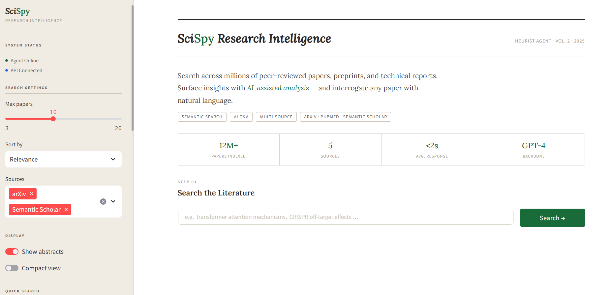
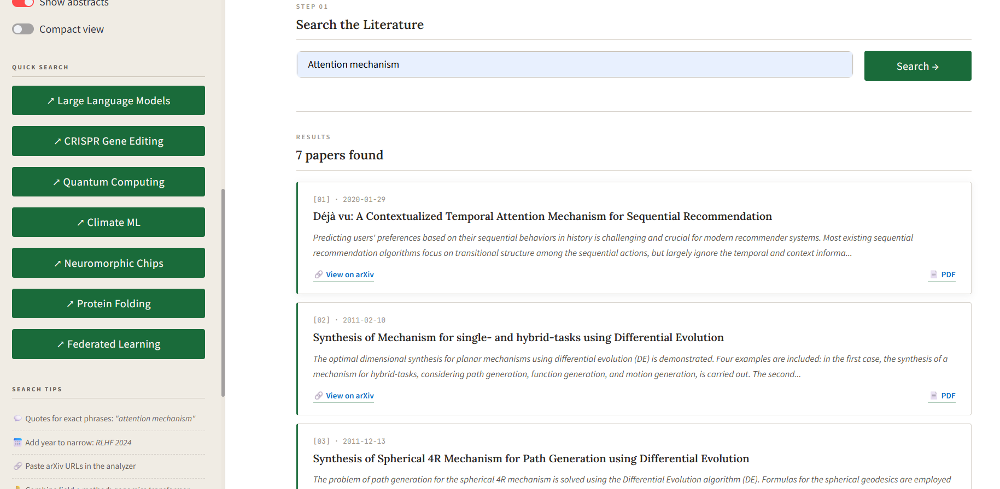
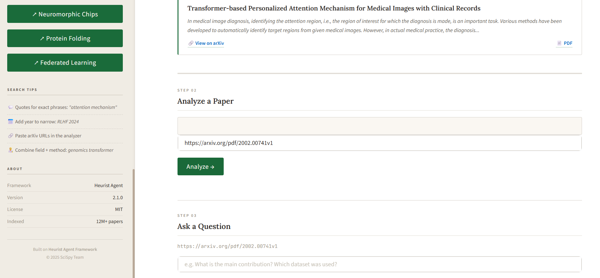
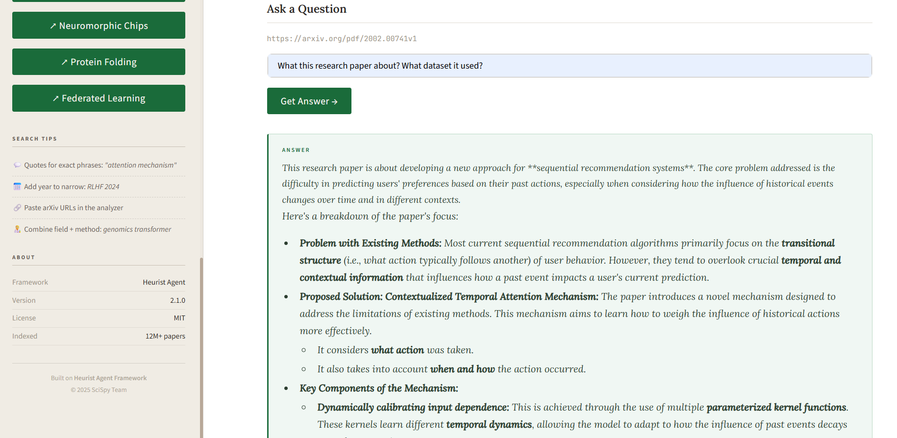

<div align="center">

# 🔬 SciSpy
### AI-Powered Research Intelligence Assistant

*Search · Analyze · Understand — research papers in seconds*

[](https://python.org)
[](https://streamlit.io)
[](https://ai.google.dev)
[](https://arxiv.org)
[](https://scispy-agent.onrender.com)
[](#-license)

[🌐 Live Demo](https://scispy-agent.onrender.com) · [📹 Watch Video](https://drive.google.com/file/d/1RA_aMklp5UZxwFy1qUjSiKqkohailE98/view?usp=sharing) · [⭐ Star this repo](https://github.com/preritasaini1/SciSPY)

</div>

---

## 📖 What is SciSpy?

**SciSpy** bridges the gap between *discovering* research and *understanding* it. Powered by the **arXiv API** for real-time paper search and **Google Gemini AI** for contextual question answering, SciSpy lets anyone — student, researcher, or curious mind — instantly explore academic literature without the usual friction.

> 💡 *Type a topic → Browse papers → Ask a question → Get an AI-generated answer. That's it.*

---

## ✨ Features

| Feature | Description |
|---|---|
| 🔎 **Real-Time Search** | Query the arXiv API and surface papers instantly |
| 🎛️ **Smart Filters** | Control max results, sort order, and data sources |
| 📄 **Paper Cards** | Clean layout with abstracts, publish date, and direct links |
| 🤖 **AI Q&A** | Ask any question about a paper — Gemini answers it |
| 📊 **Compact / Full View** | Toggle between reading modes |
| ⚡ **Fast Deployment** | Lightweight, Render-ready, minimal setup |

---

## 🖼️ Preview

### 🔍 Search Interface

*Search across any research domain with configurable filters*

### 📄 Research Results

*Structured paper cards — title, abstract, date, and direct PDF link*

### 🔍 Analyze a Paper

*Paste any arXiv paper URL to extract context and enable AI-powered Q&A*

### 🤖 AI Q&A

*Ask natural language questions, get contextual AI-generated answers*

---

## 🎥 Demo

| | |
|---|---|
| 🌐 **Live App** | [scispy-agent.onrender.com](https://scispy-agent.onrender.com) |
| 📹 **Demo Video** | [Watch here](https://drive.google.com/file/d/1RA_aMklp5UZxwFy1qUjSiKqkohailE98/view?usp=sharing) |

---

## 🧠 How It Works

```
User Query
    │
    ▼
arXiv API ──────► Paper Results (title, abstract, URL)
                        │
                        ▼
                  Select a Paper
                        │
                        ▼
              Extract Summary (Context)
                        │
                        ▼
             Google Gemini 2.5 Flash Lite
                        │
                        ▼
              Contextual Answer → UI
```

---

## 📂 Project Structure

```
SciSPY/
├── app_frontend.py       # Streamlit UI — all pages and components
├── heurist_agent.py      # Research agent — arXiv API logic
├── requirements.txt      # Python dependencies
├── runtime.txt           # Python version (for Render deployment)
├── .env                  # API keys (never commit this)
├── utils/                # Helper functions (optional)
├── config/               # App configurations
└── README.md
```

---

## ⚙️ Setup & Installation

### Prerequisites
- Python 3.10+
- A [Google Gemini API key](https://ai.google.dev)

### Steps

```bash
# 1. Clone the repository
git clone https://github.com/preritasaini1/SciSPY.git
cd SciSPY

# 2. Create and activate a virtual environment
python -m venv venv
venv\Scripts\activate        # Windows
# source venv/bin/activate   # macOS / Linux

# 3. Install dependencies
pip install -r requirements.txt

# 4. Set up your API key
# Create a .env file in the root directory:
echo GEMINI_API_KEY=your_key_here > .env

# 5. Run the app
streamlit run app_frontend.py
```

The app will open at `http://localhost:8501` 🎉

---

## 🧪 Tech Stack

| Layer | Technology |
|---|---|
| **Frontend** | Streamlit |
| **Backend Logic** | Python |
| **Research Data** | arXiv Open API |
| **AI Model** | Google Gemini 2.5 Flash Lite |
| **Deployment** | Render |

---

## 💡 Use Cases

- 🎓 **Students** — Quickly explore any research topic for coursework or projects
- 🧑‍🏫 **Educators** — Simplify complex papers for teaching
- 💻 **Developers** — Rapidly learn new technical domains
- 🧠 **Researchers** — Accelerate literature reviews and paper discovery

---

## ⚠️ Current Limitations

- Answers are based on **abstracts**, not full paper text (yet)
- Search is currently limited to **arXiv**

---

## 🚀 Roadmap

- [ ] 📑 Full PDF ingestion with RAG (Retrieval-Augmented Generation)
- [ ] 🔍 Multi-source search — IEEE, PubMed, Semantic Scholar
- [ ] 📊 Paper ranking by citations and impact
- [ ] 🆚 Side-by-side paper comparison
- [ ] ⭐ Trending / top paper highlights
- [ ] 💾 Save and export results

---

## 👩‍💻 Author

**Prerita Saini** 💙  
AI & ML Enthusiast

[](https://github.com/preritasaini1)

---

## 🙌 Acknowledgements

- [arXiv](https://arxiv.org) — for open access to research data
- [Google Gemini API](https://ai.google.dev) — for AI capabilities
- [Streamlit](https://streamlit.io) — for the rapid UI framework
- The open-source community 💛

---

## 📄 License

This project is created for **educational and demonstration purposes**.  
All rights reserved © Prerita Saini.

---

<div align="center">

💙 *Made with curiosity, passion, and a love for research.*

</div>
